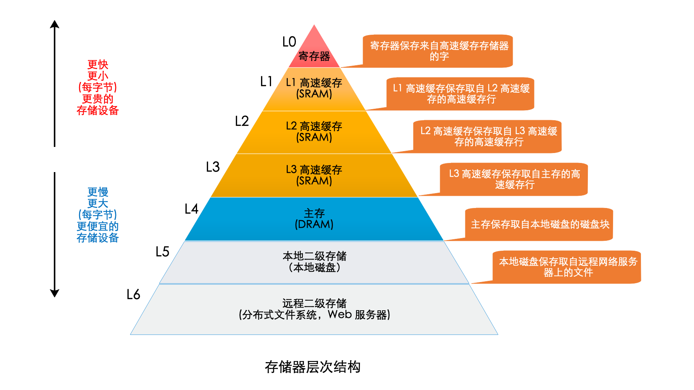
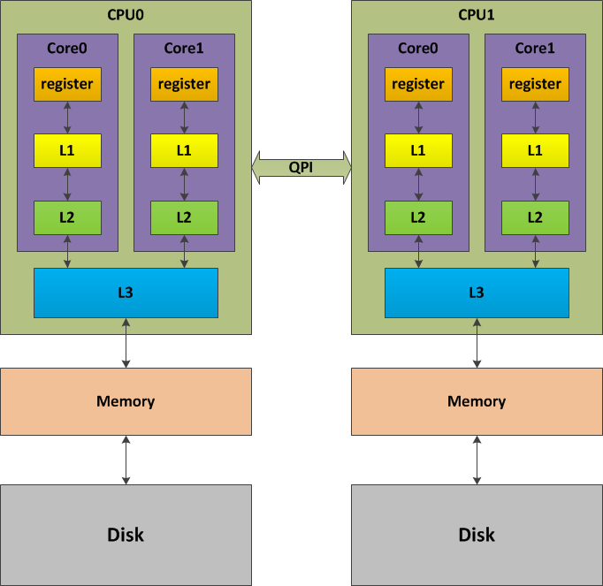
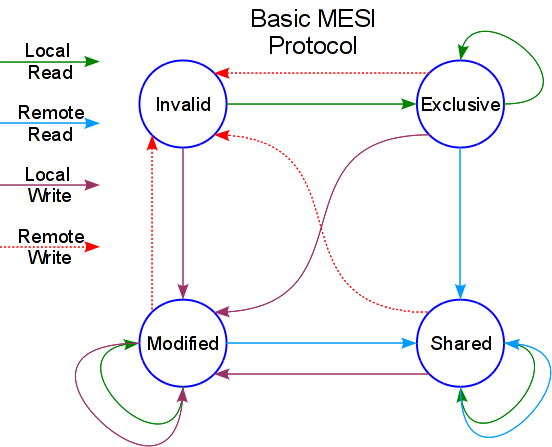
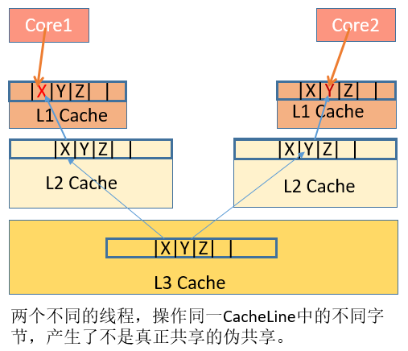

CPU Cache
=========

存储器的层次就像一个金字塔，塔顶的存储器速度快，但容量小，越往下，速度越慢，但容量越大。

# 高速缓存（Cache）

CPU高速缓存是为了解决CPU指令执行速度和主存访问速度不匹配问题，分为L1/L2/L3 Cache。其中L1/L2容量小（通常不超过几十KB），每个core独享；L3容量大（通常几百KB至几MB)，所有core共享。

## 缓存为什么有效

计算机程序运行遵循局部性原则。

局部性原理是指程序在执行时呈现出局部性规律，即在一段时间内，整个程序的执行仅限于程序中的某一部分。相应地，执行所访问的存储空间也局限于某个内存区域。

局部性原理又表现为：
 - 时间局部性（Temporal Locality）：指如果某条指令一旦被执行，很有可能不久后还会再次被执行；如果某个数据一旦被访问了，很有可能不久之后还会再次被访问。如：循环、递归等。
 - 空间局部性（Spatial Locality）：指如果某个存储单元一旦被访问了，很有可能不久后它附近的存储单元也会被访问。如连续创建多个对象、数组等。

## 缓存行（Cache Line）

缓存行（Cache Line）是高速缓存管理缓存数据的最小缓存单元，也是高速缓存和主存进行数据交换的大小。

不同CPU的缓存行对齐大小不同。Intel CPU的缓存行的大小通常是64字节。

### 查看 cache line 对齐大小
`cat /proc/cpuinfo | grep cache_alignment`

### MESI 缓存一致性协议

高速缓存虽然解决了效率问题，但是也会带来一个新的问题：缓存一致性。

解决缓存一致性方案有两种：
 - 总线加锁
 - 缓存一致性协议

#### MESI的缓存状态

每个缓存行使用4种状态进行标记，使用2bit来表示：

| 缓存状态     |  含义  | 存在位置  | 与内存一致性 | 监听其它缓存对该缓存行 |
|:------------ |:------:|:---------:|:------------:|:---------------------- |
| M(Modified)  | 被修改 | 仅本cache |    不一致    | 读主存中该缓存行的操作 |
| E(Exclusive) | 独享的 | 仅本cache |     一致     | 读主存中该缓存行的操作 |
| S(Shared)    | 共享的 | 多个cache |     一致     | 无效(I)或者独享(E)请求 |
| I(Invalid)   | 无效的 |           |              |                        |

#### MESI状态转换图

### 缓存行的伪共享问题

当多线程同时修改互相独立的变量时，如果这些变量处于同一个缓存行，就会存在缓存行上的写竞争，导致该缓存行的失效，无意中影响彼此的性能，这就是伪共享。

伪共享描是无声的性能杀手，因为从代码中很难看出是否会出现伪共享。

伪共享通常表现为并发下性能显著下降（几倍以上），并发数越多性能下降越明显。

#### 伪共享的解决方法
 1. 在有效数据中间进行字节填充，使得不同线程存取的数据位于不同的cache line上，以空间换时间。
 2. 在每个线程中创建对应数据的本地拷贝，结束后再写回全局数组。

# 参考
 - [Cache一致性协议之MESI](https://blog.csdn.net/farmwang/article/details/83376461)
 - [CPU缓存一致性协议(MESI)](https://www.cnblogs.com/flyinglion/p/15126229.html)
 - [CPU Cache与缓存行](https://blog.csdn.net/u010983881/article/details/82704733)
