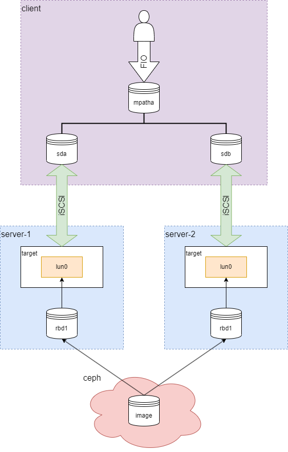

target delete lun
=================

背景
----

在一个使用multipath和iSCSI为ceph rbd提供高可用的场景中，其中一个backstore由于被添加了blacklist需要重建。



当delete lun之后，上层出现io error导致IO中断，而预期是multipath自动隔离故障路径，并在其他路径重发IO。

信息
----

查看dmesg发现，有`Data Protect`和`Write protected`打印。

```text
[  339.359104] sd 4:0:0:0: [sdc] tag#48 FAILED Result: hostbyte=DID_OK driverbyte=DRIVER_SENSE
[  339.359273] sd 4:0:0:0: [sdc] tag#67 FAILED Result: hostbyte=DID_OK driverbyte=DRIVER_SENSE
[  339.360567] sd 4:0:0:0: [sdc] tag#48 Sense Key : Data Protect [current]
[  339.361795] sd 4:0:0:0: [sdc] tag#67 Sense Key : Data Protect [current]
[  339.362742] sd 4:0:0:0: [sdc] tag#48 Add. Sense: Write protected
[  339.362747] sd 4:0:0:0: [sdc] tag#48 CDB: Write(10) 2a 00 04 ec 42 28 00 00 08 00
[  339.363673] sd 4:0:0:0: [sdc] tag#67 Add. Sense: Write protected
[  339.364573] print_req_error: critical target error, dev sdc, sector 82592296 flags ca01
[  339.365604] sd 4:0:0:0: [sdc] tag#67 CDB: Write(10) 2a 00 06 11 13 b8 00 00 08 00
[  339.366458] sd 4:0:0:0: [sdc] tag#49 FAILED Result: hostbyte=DID_OK driverbyte=DRIVER_SENSE
[  339.367548] print_req_error: critical target error, dev sdc, sector 101782456 flags ca01
[  339.368590] sd 4:0:0:0: [sdc] tag#49 Sense Key : Data Protect [current]
[  339.368594] sd 4:0:0:0: [sdc] tag#49 Add. Sense: Write protected
[  339.369989] sd 4:0:0:0: [sdc] tag#72 FAILED Result: hostbyte=DID_OK driverbyte=DRIVER_SENSE
[  339.370994] sd 4:0:0:0: [sdc] tag#49 CDB: Write(10) 2a 00 05 69 fd a0 00 00 08 00
[  339.372044] sd 4:0:0:0: [sdc] tag#72 Sense Key : Data Protect [current]
[  339.372924] print_req_error: critical target error, dev sdc, sector 90832288 flags ca01
[  339.372947] sd 4:0:0:0: [sdc] tag#50 FAILED Result: hostbyte=DID_OK driverbyte=DRIVER_SENSE
[  339.374132] sd 4:0:0:0: [sdc] tag#72 Add. Sense: Write protected
[  339.374135] sd 4:0:0:0: [sdc] tag#72 CDB: Write(10) 2a 00 06 17 81 10 00 00 08 00
[  339.375232] sd 4:0:0:0: [sdc] tag#50 Sense Key : Data Protect [current]
[  339.375234] sd 4:0:0:0: [sdc] tag#50 Add. Sense: Write protected
[  339.375235] sd 4:0:0:0: [sdc] tag#50 CDB: Write(10) 2a 00 05 96 64 78 00 00 08 00
```

调查
----

调查写保护原因，发现target会在每个`TPG`创建时就分配了`tpg_virt_lun0`，当`MappedLUN=0`被删除后target为`virtual LUN 0`强制写保护，写IO会返回`TCM_WRITE_PROTECTED`错误，而非`TCM_NON_EXISTENT_LUN`。

对于多路径`multipath`，`TCM_NON_EXISTENT_LUN`错误会将当前路径标记为`faulty`并在其他路径重发，而`TCM_WRITE_PROTECTED`错误则会直接引起`IO error`。

详细介绍请浏览：[Linux Target virtual LUN 0](../../linux/driver/target/linux_target_virtual_lun_0.md)。

结论
----

**强烈建议：不要使用`MappedLUN=0`！**
