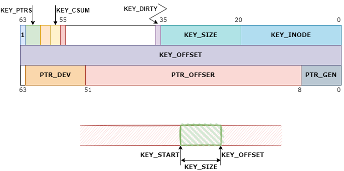

[bcache RTFSC](./) btree
========================

# bkey（btree keys）
```c
/* Btree keys - all units are in sectors */

struct bkey {
        __u64   high;
        __u64   low;
        __u64   ptr[];
};

#define KEY_FIELD(name, field, offset, size)                            \
        BITMASK(name, struct bkey, field, offset, size)

#define PTR_FIELD(name, offset, size)                                   \
static inline __u64 name(const struct bkey *k, unsigned int i)          \
{ return (k->ptr[i] >> offset) & ~(~0ULL << size); }                    \
                                                                        \
static inline void SET_##name(struct bkey *k, unsigned int i, __u64 v)  \
{                                                                       \
        k->ptr[i] &= ~(~(~0ULL << size) << offset);                     \
        k->ptr[i] |= (v & ~(~0ULL << size)) << offset;                  \
}

#define KEY_SIZE_BITS           16
#define KEY_MAX_U64S            8

KEY_FIELD(KEY_PTRS,     high, 60, 3)
KEY_FIELD(__PAD0,       high, 58, 2)
KEY_FIELD(KEY_CSUM,     high, 56, 2)
KEY_FIELD(__PAD1,       high, 55, 1)
KEY_FIELD(KEY_DIRTY,    high, 36, 1)

KEY_FIELD(KEY_SIZE,     high, 20, KEY_SIZE_BITS)
KEY_FIELD(KEY_INODE,    high, 0,  20)

/* Next time I change the on disk format, KEY_OFFSET() won't be 64 bits */

static inline __u64 KEY_OFFSET(const struct bkey *k)
{
        return k->low;
}

static inline void SET_KEY_OFFSET(struct bkey *k, __u64 v)
{
        k->low = v;
}

/*
 * The high bit being set is a relic from when we used it to do binary
 * searches - it told you where a key started. It's not used anymore,
 * and can probably be safely dropped.
 */
#define KEY(inode, offset, size)                                        \
((struct bkey) {                                                        \
        .high = (1ULL << 63) | ((__u64) (size) << 20) | (inode),        \
        .low = (offset)                                                 \
})

#define KEY_START(k)                    (KEY_OFFSET(k) - KEY_SIZE(k))
```

数据结构示意如下图：


## KEY_DIRTY
若为writeback写，`bch_data_insert_start`会在插入的bkey前将dirty置位。
```c
static void bch_data_insert_start(struct closure *cl)
{
        ...

        do {
                ...

                if (op->writeback) {
                        SET_KEY_DIRTY(k, true);

                        for (i = 0; i < KEY_PTRS(k); i++)
                                SET_GC_MARK(PTR_BUCKET(op->c, k, i),
                                            GC_MARK_DIRTY);
                }

                ...
        } while (n != bio);

        ...
}
```

当`write_dirty_finish`时，若dirty被置位则将其清除并重新插入bkey。
```c
static void write_dirty_finish(struct closure *cl)
{
        ...

        /* This is kind of a dumb way of signalling errors. */
        if (KEY_DIRTY(&w->key)) {
                ...
                struct keylist keys;

                bch_keylist_init(&keys);

                bkey_copy(keys.top, &w->key);
                SET_KEY_DIRTY(keys.top, false);
                bch_keylist_push(&keys);

                ...

                ret = bch_btree_insert(dc->disk.c, &keys, NULL, &w->key);

                if (ret)
                        trace_bcache_writeback_collision(&w->key);

                atomic_long_inc(ret
                                ? &dc->disk.c->writeback_keys_failed
                                : &dc->disk.c->writeback_keys_done);
        }

        ...
}
```

需要注意的是，`dirty_endio`中将dirty清除只是用来标识`write_dirty`的io_error。因为，在`write_dirty_finish`中通过dirty标志位来判断是否出现io_error。同时，此处的bkey空间是为`write_dirty`而开辟的新空间，清除的并不是btree中实际的bkey上的dirty，所以不会有数据损坏的风险。
```c
static void dirty_endio(struct bio *bio)
{
        struct keybuf_key *w = bio->bi_private;
        struct dirty_io *io = w->private;

        if (bio->bi_status) {
                SET_KEY_DIRTY(&w->key, false);
                bch_count_backing_io_errors(io->dc, bio);
        }

        closure_put(&io->cl);
}
```


# 参考
 * []()
