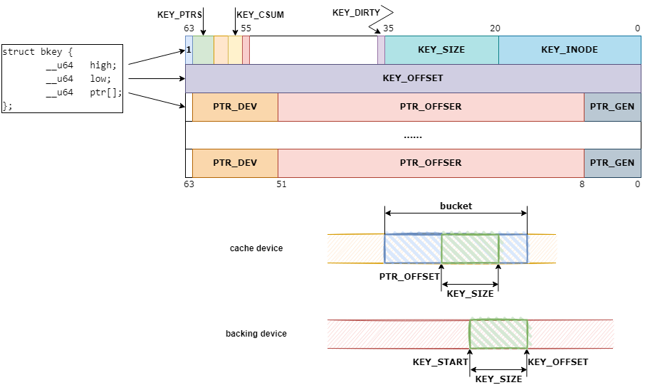

bcache btree
============

# bkey（btree keys）
```c
/* Btree keys - all units are in sectors */

struct bkey {
        __u64   high;
        __u64   low;
        __u64   ptr[];
};

#define KEY_FIELD(name, field, offset, size)                            \
        BITMASK(name, struct bkey, field, offset, size)

#define PTR_FIELD(name, offset, size)                                   \
static inline __u64 name(const struct bkey *k, unsigned int i)          \
{ return (k->ptr[i] >> offset) & ~(~0ULL << size); }                    \
                                                                        \
static inline void SET_##name(struct bkey *k, unsigned int i, __u64 v)  \
{                                                                       \
        k->ptr[i] &= ~(~(~0ULL << size) << offset);                     \
        k->ptr[i] |= (v & ~(~0ULL << size)) << offset;                  \
}

#define KEY_SIZE_BITS           16
#define KEY_MAX_U64S            8

KEY_FIELD(KEY_PTRS,     high, 60, 3)
KEY_FIELD(__PAD0,       high, 58, 2)
KEY_FIELD(KEY_CSUM,     high, 56, 2)
KEY_FIELD(__PAD1,       high, 55, 1)
KEY_FIELD(KEY_DIRTY,    high, 36, 1)

KEY_FIELD(KEY_SIZE,     high, 20, KEY_SIZE_BITS)
KEY_FIELD(KEY_INODE,    high, 0,  20)

/* Next time I change the on disk format, KEY_OFFSET() won't be 64 bits */

static inline __u64 KEY_OFFSET(const struct bkey *k)
{
        return k->low;
}

static inline void SET_KEY_OFFSET(struct bkey *k, __u64 v)
{
        k->low = v;
}

/*
 * The high bit being set is a relic from when we used it to do binary
 * searches - it told you where a key started. It's not used anymore,
 * and can probably be safely dropped.
 */
#define KEY(inode, offset, size)                                        \
((struct bkey) {                                                        \
        .high = (1ULL << 63) | ((__u64) (size) << 20) | (inode),        \
        .low = (offset)                                                 \
})

#define KEY_START(k)                    (KEY_OFFSET(k) - KEY_SIZE(k))
```

数据结构示意如下图：


# 参考
 * []()
