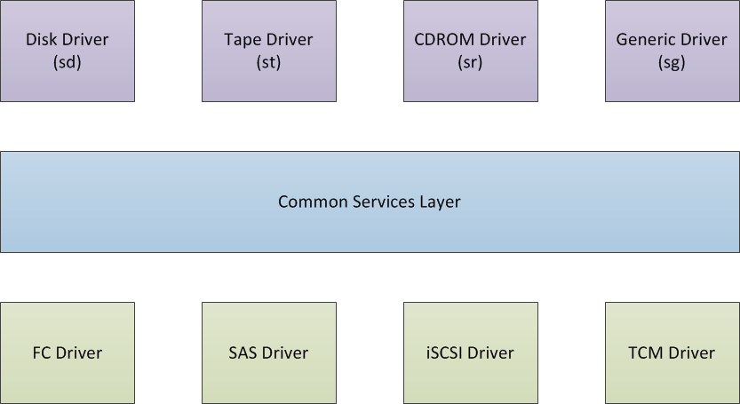
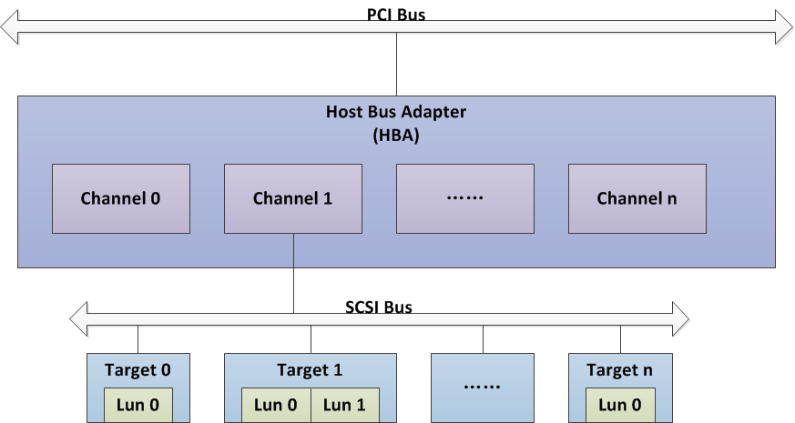

Linux SCSI
==========

Linux SCSI分为3层，各层具体：

- **高层（上层）：** 它代表各种SCSI设备类型的驱动（例如：SCSI磁盘驱动、SCSI磁带驱动等），高层驱动认领底层驱动发现的SCSI设备，为这些设备分配名称，将对设备的IO转换为SCSI命令交由底层驱动处理。
- **底层（下层）：** 它代表与SCSI的物理接口的驱动器，主要为各个厂商为其特定的主机适配器驱动（例如：FC卡驱动、SAS卡驱动和iSCSI驱动等）。主要作用是发现连接到主机适配器的SCSI设备，在内存中构建SCSI子系统所需的数据结构，并提供消息传递接口，将SCSI命令的接受与发送解释为主机适配器的操作。
- **中层：** 包含SCSI栈的公共服务函数。高层和底层通过调用中层的函数完成其功能，而中层在执行过程中也需要调用高层和底层注册的回调函数做一些个性化处理。

Linux SCSI 模型
---------------

Linux SCSI 模型是内核的抽象，主机适配器连接主机IO总线（如PCI总线）如)和存储IO总线（如SCSI总线）。一台计算机可以有多个主机适配器，而主机适配器可以控制一条或多条SCSI总线，一条SCSI总线可以有多个目标节点与之相连，并且一个目标节点可以有多个逻辑单元。

在 Linux SCSI 子系统中，Host对应主机适配器（物理的HBA/RAID卡，虚拟的iSCSI Target），目标节点（Target）对应SCSI磁盘。SCSI磁盘中可以有多个逻辑单元（LUN），统一由磁盘控制器控制，这些逻辑单元才是真正作为IO终点的存储设备，内核用设备（Device）对逻辑单元进行抽象。

### Linux SCSI 四元组

内核通过四元组（host:channel:target:lun）来标识唯一的SCSI逻辑单元（设备）：

- host: 主机适配器的唯一编号。
- channel: 主机适配器中SCSI通道编号。
- target: 目标节点唯一标识符。
- lun: 目标节点内逻辑单元编号。

SCSI 命令
---------

SCSI 命令是在 Command Descriptor Block （CDB）中定义的。CDB 包含了用来定义要执行的特定操作的操作代码，以及大量特定于操作的参数。

参考
----

- [Linux存储IO栈（4）-- SCSI子系统之概述](https://blog.csdn.net/haleycomet/article/details/52596355)
- [LIO与ISCSI——SCSI Target 之双城记](https://blog.csdn.net/CSND_PAN/article/details/79015240)
