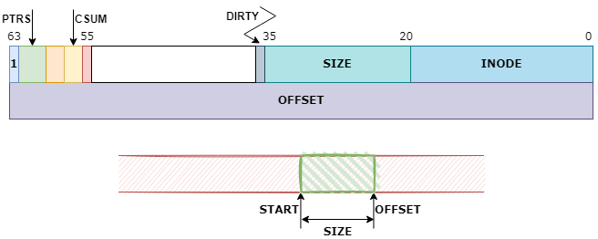

bcache btree
============

# bkey（btree keys）
```c
/* Btree keys - all units are in sectors */

struct bkey {
        __u64   high;
        __u64   low;
        __u64   ptr[];
};

/*
 * The high bit being set is a relic from when we used it to do binary
 * searches - it told you where a key started. It's not used anymore,
 * and can probably be safely dropped.
 */
#define KEY(inode, offset, size)                                        \
((struct bkey) {                                                        \
        .high = (1ULL << 63) | ((__u64) (size) << 20) | (inode),        \
        .low = (offset)                                                 \
})

#define KEY_START(k)                    (KEY_OFFSET(k) - KEY_SIZE(k))
```

数据结构示意如下图：


# 参考
 * []()
